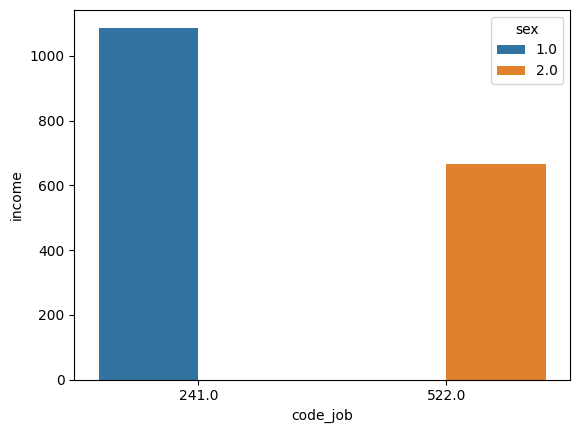

# 한국인의 삶을 분석하고 파악하라
=========================================
## 시작일시: 2023.05.31
=========================================
## 프로젝트 팀원: 송우석(2,3,4번 완성 끝), 이성혁(5번완성, 6번완성, 7번완성)
## 분석하고자 하는 문제 정의 (가설)
> 1. 성별에 따라 월급이 다를까?
> 2. 몇 살 때 월급을 가장 많이 받을까?
> 3. 어떤 연령대의 월급이 가장 많을까?
> 4. 성별 월급 차이는 연령대별로 다를까?
> 5. 어떤 직업이 월급을 가장 많이 받을까?
> 6. 성별로 어떤 직업이 가장 많을까?
> 7. 종교가 있으면 이혼을 덜 할까?
> 8. 어느 지역에 노년층이 많을까?

## 1. 성별에 따라 월급이 다를까?
#### 실현 코드:
```
# 성별 변수 검토 및 전처리하기
# 1. 변수 검토하기
welfare['sex'].dtypes # 변수 타입 출력

# 2. 전처리하기
# 이상치 확인
welfare['sex'].value_counts() # 빈도 구하기

# 이상치 결측 처리
welfare['sex'] = np.where(welfare['sex'] == 9, np.nan, welfare['sex'])

# 결측치 확인
welfare['sex'].isna().sum()

# 성별 항목 이름 부여
welfare['sex'] = np.where(welfare['sex'] == 1, 'male', 'female')

# 월급 변수 검토 및 전처리하기
# 1. 변수 검토하기
welfare['income'].dtypes # 변수 타입 출력

welfare['income'].describe() # 요약 통계량 구하기

sns.histplot(data = welfare, x = 'income')

# 2. 전처리하기
welfare['income'].describe() # 이상치 확인

welfare['income'].isna().sum() # 결측치 확인

## 성별 월급 평균표 만들기
sex_income = welfare.dropna(subset = ['income']).groupby('sex', as_index = False).agg(mean_income = ('income', 'mean')) # income 평균 구하기

sex_income

# 빈도 구하기
welfare['sex'].value_counts()
## 성별 월급 평균표 만들기
sex_income = welfare.dropna(subset = ['income']).groupby('sex', as_index = False).agg(mean_income = ('income', 'mean')) # income 평균 구하기

sns.barplot(data = sex_income, x = 'sex', y = 'mean_income')
```
#### 히스토그램

#### 막대그래프

> 결론: 관계가 있다.

## 2. 몇 살 때 월급을 가장 많이 받을까? [송우석님 작성]

#### 실현 코드:
```
plt.rcParams['font.family'] = 'D2Coding'

raw_welfare = pd.read_spss('../Koweps_hpwc14_2019_beta2.sav')
welfare = raw_welfare.copy()
welfare = welfare.rename(columns = {'h14_g3':'sex',
                                    'h14_g4':'birth',
                                    'h14_g10':'marriage_type',
                                    'h14_g11':'religion',
                                    'p1402_8aq1':'income',
                                    'h14_eco9':'code_job',
                                    'h14_reg7':'code_region'})

# birth열로 나이 계산해 age열 생성
welfare['age'] = 2019-welfare['birth']
age_income = welfare.dropna(subset = ['income'])\
    .groupby('age', as_index = False)\
        .agg(average_income = ('income', 'mean'))

# 10대~90대 구간의 경계값 설정
bins = [9, 19, 29, 39, 49, 59, 69, 79, 89, 99]
labels = ['10대', '20대', '30대', '40대', '50대', '60대', '70대', '80대', '90대']

# 경계값을 기준으로 나누고, 라벨을 붙여서 age_income 데이터프레임에 age_group열을 만듦
age_income['age_group'] = pd.cut(age_income['age'], bins=9, labels=labels)
age_group_income = age_income\
    .groupby('age_group', as_index = False)\
        .agg(average_income = ('average_income', 'mean'))

# 40대의 월급이 가장 많다.
sns.barplot(data = age_group_income, x = 'age_group', y = 'average_income')
plt.show()
```

#### 막대그래프

>결론: 43세가 평균 월급을 가장 많이 받는다.

## 3. 어떤 연령대의 월급이 가장 많을까? [송우석님 작성]

#### 실현 코드:
````
#한글 폰트 지정
plt.rcParams['font.family'] = 'D2Coding'

raw_welfare = pd.read_spss('../Koweps_hpwc14_2019_beta2.sav')
welfare = raw_welfare.copy()
welfare = welfare.rename(columns = {'h14_g3':'sex',
                                    'h14_g4':'birth',
                                    'h14_g10':'marriage_type',
                                    'h14_g11':'religion',
                                    'p1402_8aq1':'income',
                                    'h14_eco9':'code_job',
                                    'h14_reg7':'code_region'})

# birth열로 나이 계산해 age열 생성
welfare['age'] = 2019-welfare['birth']
age_income = welfare.dropna(subset = ['income'])\
    .groupby('age', as_index = False)\
        .agg(average_income = ('income', 'mean'))

# 10대~90대 구간의 경계값 설정
bins = [9, 19, 29, 39, 49, 59, 69, 79, 89, 99]
labels = ['10대', '20대', '30대', '40대', '50대', '60대', '70대', '80대', '90대']

# 경계값을 기준으로 나누고, 라벨을 붙여서 age_income 데이터프레임에 age_group열을 만듦
age_income['age_group'] = pd.cut(age_income['age'], bins=9, labels=labels)
age_group_income = age_income\
    .groupby('age_group', as_index = False)\
        .agg(average_income = ('average_income', 'mean'))

# 40대의 월급이 가장 많다.
sns.barplot(data = age_group_income, x = 'age_group', y = 'average_income')
plt.show()
````
#### 막대그래프:

>결론: 40대의 월급이 가장 많다.

## 4. 성별 월급 차이는 연령대별로 다를까? [송우석님 작성]

#### 실현 코드:
```
plt.rcParams['font.family'] = 'D2Coding'

raw_welfare = pd.read_spss('../Koweps_hpwc14_2019_beta2.sav')
welfare = raw_welfare.copy()
welfare = welfare.rename(columns = {'h14_g3':'sex',
                                    'h14_g4':'birth',
                                    'h14_g10':'marriage_type',
                                    'h14_g11':'religion',
                                    'p1402_8aq1':'income',
                                    'h14_eco9':'code_job',
                                    'h14_reg7':'code_region'})

# 성별 항목 이름 부여
welfare['sex'] = np.where(welfare['sex'] == 1, 'male', 'female')

# birth열로 나이 계산해 age열 생성
welfare['age'] = 2019-welfare['birth']

# 10대~90대 구간의 경계값 설정
bins = [9, 19, 29, 39, 49, 59, 69, 79, 89, 99]
labels = ['10대', '20대', '30대', '40대', '50대', '60대', '70대', '80대', '90대']

# 경계값을 기준으로 나누고, 라벨을 붙여서 welfare 데이터프레임에 age_group열을 만듦
welfare['age_group'] = pd.cut(welfare['age'], bins=bins, labels=labels, right=False)

# income열에 결측값이 있는 행 제거
welfare = welfare.dropna(subset = ['income'])

# female이 들어가는 행에서 'sex', 'age_group', 'income'열만 추출
female_data = welfare[welfare['sex'] == 'female'][['sex', 'age_group', 'income']]
# female_data에서 나이대별 월급 평균표 생성
female_age_group_income = female_data\
    .groupby('age_group', as_index = False)\
        .agg(average_income = ('income', 'mean'))

# female_data와 동일한 작업
male_data = welfare[welfare['sex'] == 'male'][['sex', 'age_group', 'income']]
male_age_group_income = male_data\
    .groupby('age_group', as_index = False)\
        .agg(average_income = ('income', 'mean'))

# x축 구간 나누기
x = np.arange(9)

# Female, Male 그래프
plt.bar(x - 0.2, female_age_group_income['average_income'], width=0.4, color='magenta', label='Female')
plt.bar(x + 0.2, male_age_group_income['average_income'], width=0.4, color='cyan', label='Male')

# 그래프 서식
plt.title('Average Income by Age Group')
plt.xticks(x, female_age_group_income['age_group'])
plt.ylabel('Average Income')
plt.legend()

# 성별에 따른 월급은 90대를 제외한 구간에서 남성이 여성보다 많고, 그 차이는 50대에서 가장 크게 나타난다.
plt.show()
```
#### 막대그래프


> 결론: 성별에 따른 월급은 90대를 제외한 구간에서 남성이 여성보다 많고, 그 차이는 50대에서 가장 크게 나타난다.

## 5. 어떤 직업이 월급을 가장 많이 받을까? [이성혁님 작성]
#### 실현 코드:
```
# 작업 변수 검토 및 전처리하기
# 1. 직업 변수 검토업 및 전처리하기
welfare['code_job'].dtypes # 변수 타입 출력

# 2. 전처리하기
# 이상치 확인
welfare['code_job'].value_counts() # 빈도수 확인

# 직업별 월급 평균 계산하기 (groupby함수 이용)
job_income_avg = welfare.groupby('code_job')['income'].mean()
# 작업별 월급 평균표 만들기
job_income = welfare.dropna(subset = ['income']).groupby('code_job', as_index = False).agg(mean_income = ('income', 'mean'))
print(job_income_avg)
# 월급이 가장 높은 직업 찾기
highest_income_job = job_income_avg.idxmax()

# 결과 출력
print("결론: 가장 많은 월급을 받는 직업코드는 :", highest_income_job)
# 히스토그램
sns.histplot(data = welfare, x = 'income')
# 막대그래프
sns.barplot(data = job_income, x = 'code_job', y = 'mean_income')
```
#### 히스토그램

#### 막대그래프

> 결론: 직업코드: 241(의료 진료 전문가)이 가장 많이 받는다.

## 6. 성별로 어떤 직업이 가장 많을까?

#### 실현 코드:
```
# 데이터 불러오기
raw_welfare = pd.read_spss('../Koweps_hpwc14_2019_beta2.sav')

# 복수본 만들기
welfare = raw_welfare.copy()

# 데이터 검토하기
welfare # 앞부분, 뒷부분 출력
welfare.shape # 행, 열 개수 출력
welfare.info() # 변수 속성 출력
welfare.describe() # 요약 통계량

welfare = welfare.rename(columns = {
    'h14_g3' : 'sex',
    'h14_g4' : 'birth',
    'h14_g10' : 'marriage_type',
    'h14_g11' : 'religion',
    'p1402_8aq1' : 'income',
    'h14_eco9' : 'code_job',
    'h14_reg7' : 'code_region'
})
# 성별과 직업 변수 선택
gender_job = welfare[['sex', 'code_job']]

# 성별과 직업별 개수 계산
gender_job_count = gender_job.groupby(['sex', 'code_job']).size().reset_index(name='count')

# 성별에 따른 가장 많은 직업별 평균 소득 계산
gender_job_income = welfare.groupby(['sex', 'code_job'])['income'].mean().reset_index()

# 성별에 따른 가장 많은 직업 추출
most_common_jobs = gender_job_income.groupby('sex')['income'].idxmax()
most_common_jobs = gender_job_income.loc[most_common_jobs]

# 시각화
sns.barplot(data=most_common_jobs, x= 'code_job', y='income', hue='sex')
```
#### 막대그래프


> 결론: 직업코드: 241(의료 진료 전문가)이 가장 많다.

## 7. 종교가 있으면 이혼을 덜 할까?

#### 실현 코드:
```
# 데이터 불러오기
raw_welfare = pd.read_spss('../Koweps_hpwc14_2019_beta2.sav')

# 복수본 만들기
welfare = raw_welfare.copy()

# 데이터 검토하기
welfare # 앞부분, 뒷부분 출력
welfare.shape # 행, 열 개수 출력
welfare.info() # 변수 속성 출력
welfare.describe() # 요약 통계량

welfare = welfare.rename(columns = {
    'h14_g3' : 'sex',
    'h14_g4' : 'birth',
    'h14_g10' : 'marriage_type',
    'h14_g11' : 'religion',
    'p1402_8aq1' : 'income',
    'h14_eco9' : 'code_job',
    'h14_reg7' : 'code_region'
})
# 종교와 이혼 변수 선택
religion_divorce = welfare[['religion', 'marriage_type']]

# 종교와 이혼 여부 변환
religion_divorce['divorced'] = np.where(religion_divorce['marriage_type'] == 3, 1, 0)

# 종교별 이혼 비율 계산
divorce_ratio = religion_divorce.groupby('religion')['divorced'].mean().reset_index()

# 시각화
sns.barplot(data=divorce_ratio, x='religion', y='divorced')


```
#### 막대그래프


> 결론: 아닙니다.